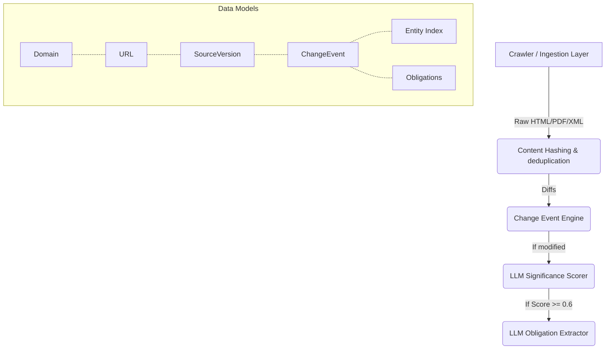

# Regulatory Watch — v1

An enterprise-grade, AI-powered regulatory monitoring platform. Regulatory Watch tracks domains, pages, documents, and feeds to automatically ingest, version, and analyze changes in regulatory rules. It extracts actionable compliance obligations, detects entity-level impacts, and tracks global trade flow implications.

## Key Features

- **Multi-modal Crawler Pipeline**: A resilient fetching layer utilizing **Crawl4AI** (with a stealth headless browser for JS-rich sites and semantic DOM pruning) falling back to `httpx`. Supports Web, PDF, RSS, XML, and Email ingestion natively.
- **Change Detection Engine**: Computes exact text diffs (`change_events`) and tracks immutable `SourceVersion` histories for auditability.
- **LLM-Powered Significance Scoring**: Automatically analyzes text diffs via OpenAI models to score legislative significance (from `0.0` to `1.0`) and categorize topics (e.g., *data_privacy*, *financial_services*).
- **Obligation Extraction (M4 Phase 3)**: For high-significance changes (score ≥ 0.6), the platform uses a secondary LLM pipeline to structure text into actionable, queryable SQL tables (`Actor`, `Action`, `Deadline`, `Penalty`).
- **Entity Indexing**: Normalizes and indexes affected regulatory bodies, programs, and industries directly extracted by the LLMs.
- **Robust Infrastructure**: Fully containerized queue-driven stack powered by **FastAPI**, **PostgreSQL**, **Redis**, **Celery** (for fetching/LLM queue distribution), and **Kafka/Zookeeper** (for cross-service message passing).

## Quick Start

```bash
# Start all 7 services (API, DB, Redis, Celery, Flower, Kafka, Zookeeper)
make up

# Wait ~30 seconds for services, then run smoke tests
make test
```

## Services & Ports

| Service   | Address                       | Description                   |
| --------- | ----------------------------- | ----------------------------- |
| API       | http://localhost:8001         | FastAPI REST API               |
| Docs      | http://localhost:8001/docs    | Swagger UI (auto-generated)    |
| Flower    | http://localhost:5555         | Celery task monitoring         |
| PostgreSQL| localhost:5433                | Relational Database (regwatch) |
| Redis     | localhost:6379                | Task broker + cache            |
| Kafka     | localhost:9092                | Message bus                    |

## Core Architecture



## API Endpoints (`app/routers/`)

### Domains
- `POST /domains` — Register a new regulatory domain to monitor.
- `GET /domains` — List domains (paginated, filterable by status).
- `GET /domains/{id}` — Get single domain via ID.
- `PATCH /domains/{id}` — Partially update a domain's properties.
- `DELETE /domains/{id}` — Remove a domain from monitoring.

### Health
- `GET /health` — Application reachability
- `GET /health/db` — DB Connectivity checks
- `GET /health/redis` — Redis Connectivity checks

## Under the Hood

### Ingestion (`app/ingestion/`)
- **WebConnector**: A BFS asynchronous web crawler. Uses `AsyncWebCrawler` from `crawl4ai` with a `PruningContentFilter` to automatically identify the main article content and strip out boilerplate HTML. Respects `robots.txt` and automatically detects/surfaces Captcha/blocker interstitials (`blocker_detect.py`).
- **Other Connectors**: Built-in implementations for PDFs (`pdf_connector.py` relying on `pdfplumber` and `docling`), RSS Feeds (`rss_connector.py`), and raw XML trees.

### Background Jobs (`app/celery_app.py`, `app/services/`)
- Scheduled workers via **Celery Beat** poll seed URLs periodically based on the domain's rate limits.
- If content hashes change, the engine builds a unified diff and triggers the **Significance Service** (`services/significance.py`).
- For substantive changes, the **Obligation Service** (`services/obligations.py`) parses out exactly compliance instructions ("who must do what by when").

## Environment Variables

| Variable                  | Description          |
| ------------------------- | -------------------- |
| `DATABASE_URL`            | PostgreSQL connection (default: `postgresql://regwatch:regwatch_secret@db:5432/regwatch`) |
| `REDIS_URL`               | Redis connection (default: `redis://redis:6379/0`) |
| `KAFKA_BOOTSTRAP_SERVERS` | Kafka broker address  (default: `kafka:29092`) |
| `OPENAI_API_KEY`          | **Required** for LLM services (`sig scoring`, `entity extraction`, `obligation mining`). |

## Makefile Commands

```bash
make up              # Start all services
make down            # Stop all services
make clean           # Stop + remove volumes
make logs            # Tail all logs
make logs-api        # Tail API logs only
make logs-worker     # Tail worker logs only
make migrate         # Run Alembic migrations
make test            # Run smoke tests
make shell           # Shell into API container
make status          # Show container status
```
